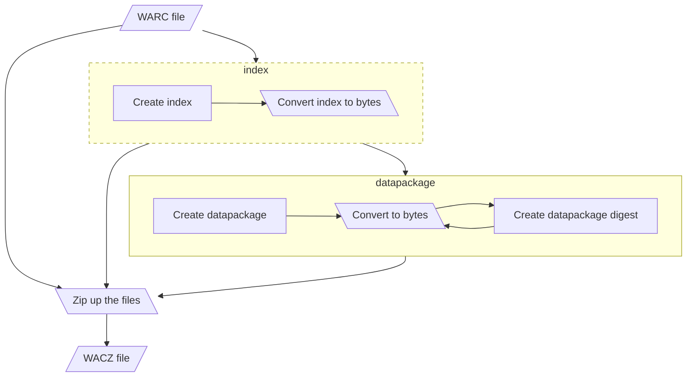

A WACZ file is essentially [a zip file](https://bikeshed.vibber.net/@brooke/114240574949828718); according to [the example in the spec](https://specs.webrecorder.net/wacz/1.1.1/) it should contain:

```
archive
└── data.warc.gz
datapackage.json
datapackage-digest.json
indexes
└── index.cdx.gz
pages
└── pages.jsonl
```

## Operations chart

Broadly what needs to be done, read the WACZ file, create an index and, a datapackage, _in that order_ and then convert everything to bytes and zip it up.


